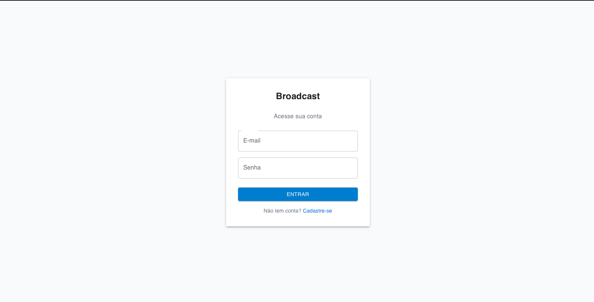
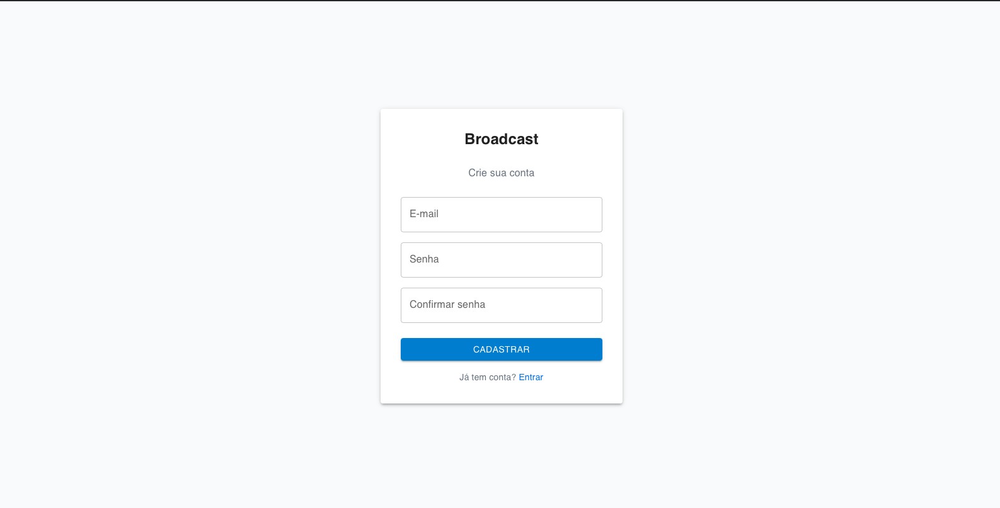
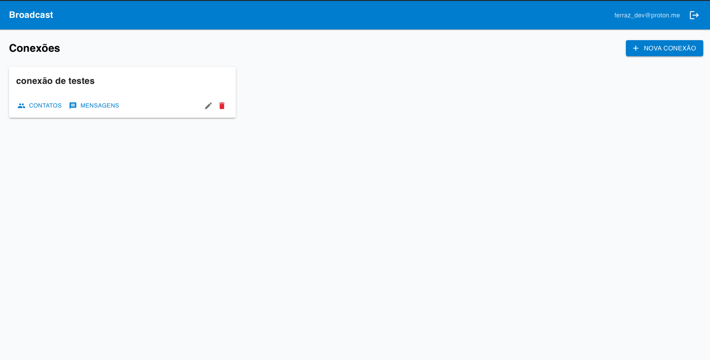
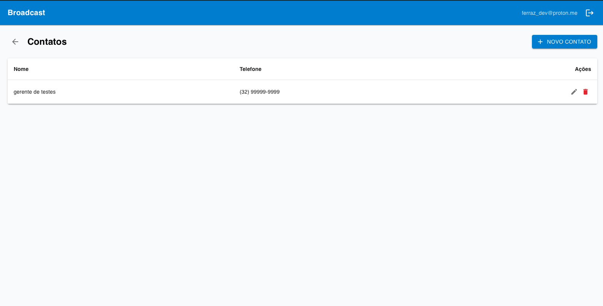
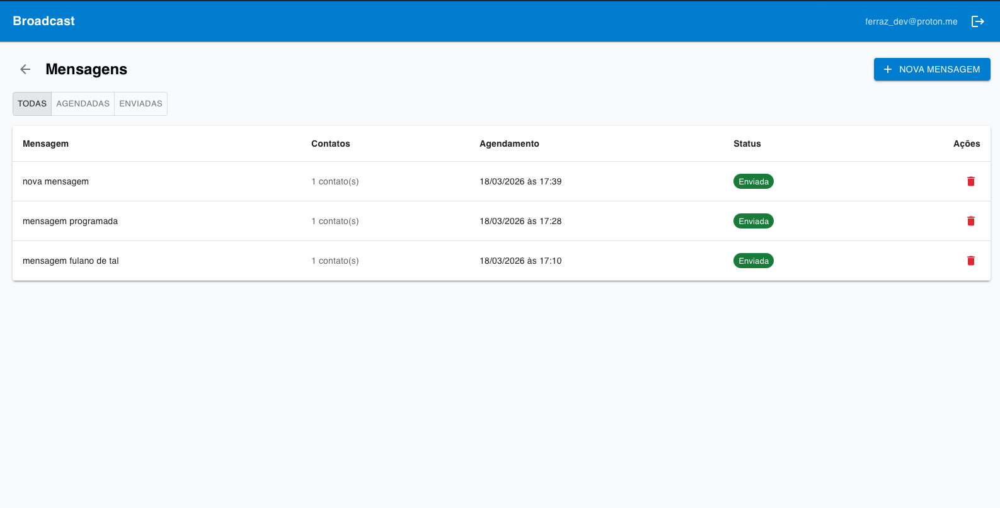
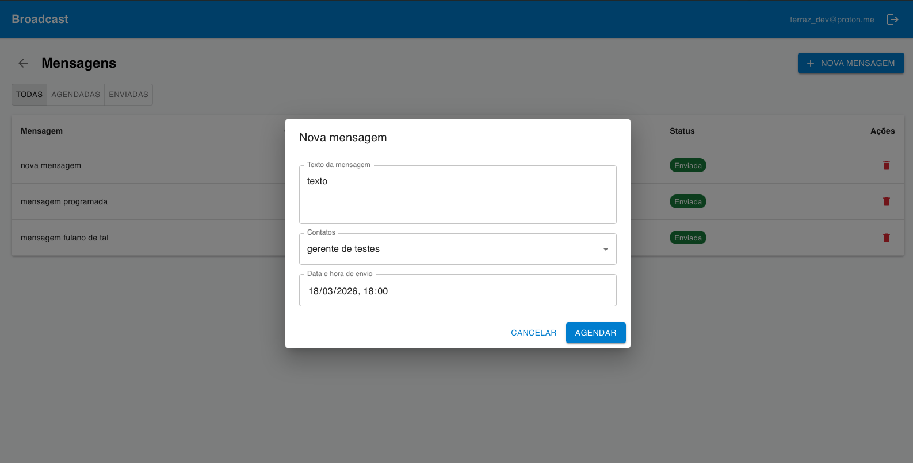

# 📡 Broadcast

Plataforma SaaS para gerenciamento de conexões, contatos e envio de mensagens em massa com agendamento automático.

> Cada usuário gerencia suas próprias conexões, contatos e mensagens de forma completamente isolada.

🔗 **Demo:** [broadcast-651ee.web.app](https://broadcast-651ee.web.app)

---

## ✨ Funcionalidades

- **Autenticação** — Cadastro e login com e-mail e senha (Firebase Auth)
- **Conexões** — Organize seus canais de envio em conexões separadas
- **Contatos** — Cadastre e gerencie contatos por conexão (com máscara de telefone)
- **Mensagens** — Crie mensagens para múltiplos contatos com agendamento de data e hora
- **Disparo automático** — Firebase Function processa mensagens agendadas a cada minuto e muda o status para "enviada"
- **Filtros** — Filtre mensagens por status: Todas / Agendadas / Enviadas
- **Tempo real** — Dados sincronizados em tempo real via Firestore `onSnapshot`
- **Isolamento SaaS** — Cada usuário vê apenas seus próprios dados (regras no Firestore)

---

## 📸 Screenshots

### Login


### Cadastro


### Conexões


### Contatos


### Mensagens


### Nova mensagem


---

## 🛠️ Stack

| Camada | Tecnologia |
|--------|-----------|
| Frontend | React 18 + TypeScript + Vite |
| UI | Material UI v5 + Tailwind CSS v3 |
| Formulários | React Hook Form |
| Roteamento | React Router DOM v6 |
| Datas | date-fns (pt-BR) |
| Backend | Firebase Auth + Firestore + Functions v2 |
| Hospedagem | Firebase Hosting |

---

## 🗂️ Estrutura do projeto

```
broadcast/
├── web/                    # Frontend React
│   └── src/
│       ├── components/     # Componentes reutilizáveis (AppLayout, PrivateRoute)
│       ├── contexts/       # AuthContext
│       ├── hooks/          # useConnections, useContacts, useMessages
│       ├── lib/            # Configuração do Firebase
│       ├── pages/          # LoginPage, RegisterPage, ConnectionsPage, ContactsPage, MessagesPage
│       ├── services/       # Acesso ao Firestore (CRUD + onSnapshot)
│       └── types/          # Tipos TypeScript centralizados
├── functions/              # Firebase Functions v2
│   └── src/
│       └── index.ts        # Função agendada: processa mensagens a cada 1 minuto
├── firestore.rules         # Regras de segurança Firestore (isolamento por userId)
├── firestore.indexes.json  # Índices compostos do Firestore
└── firebase.json           # Configuração do Firebase CLI
```

---

## 🚀 Como rodar localmente

### Pré-requisitos

- Node.js 18+
- Conta no [Firebase](https://console.firebase.google.com)
- Firebase CLI: `npm install -g firebase-tools`

### 1. Clone o repositório

```bash
git clone https://github.com/seu-usuario/broadcast.git
cd broadcast
```

### 2. Configure o Firebase

1. Crie um projeto no [Firebase Console](https://console.firebase.google.com)
2. Ative **Authentication** (e-mail/senha)
3. Crie o **Firestore** em modo produção
4. Registre um **Web App** e copie as credenciais

### 3. Configure as variáveis de ambiente

```bash
cp web/.env.example web/.env
```

Preencha o arquivo `web/.env` com as credenciais do seu projeto Firebase:

```env
VITE_FIREBASE_API_KEY=...
VITE_FIREBASE_AUTH_DOMAIN=...
VITE_FIREBASE_PROJECT_ID=...
VITE_FIREBASE_STORAGE_BUCKET=...
VITE_FIREBASE_MESSAGING_SENDER_ID=...
VITE_FIREBASE_APP_ID=...
```

### 4. Instale as dependências

```bash
cd web && npm install
cd ../functions && npm install
```

### 5. Deploy do Firestore (regras e índices)

```bash
cd ..
firebase login
firebase use --add   # selecione seu projeto
firebase deploy --only firestore
```

### 6. Deploy das Functions

```bash
firebase deploy --only functions --force
```

### 7. Rode o frontend

```bash
cd web && npm run dev
```

Acesse [http://localhost:5173](http://localhost:5173)

---

## 🌐 Deploy em produção

```bash
cd web && npm run build
cd ..
firebase deploy --only hosting
```

---

## 🔒 Segurança

- Cada documento no Firestore exige `userId == request.auth.uid`
- Regras impedem que um usuário acesse dados de outro
- Senhas exigem mínimo 8 caracteres com maiúsculas, minúsculas, números e caracteres especiais
- Variáveis de ambiente **nunca** são commitadas (`.env` no `.gitignore`)

---

## 📄 Licença

MIT
